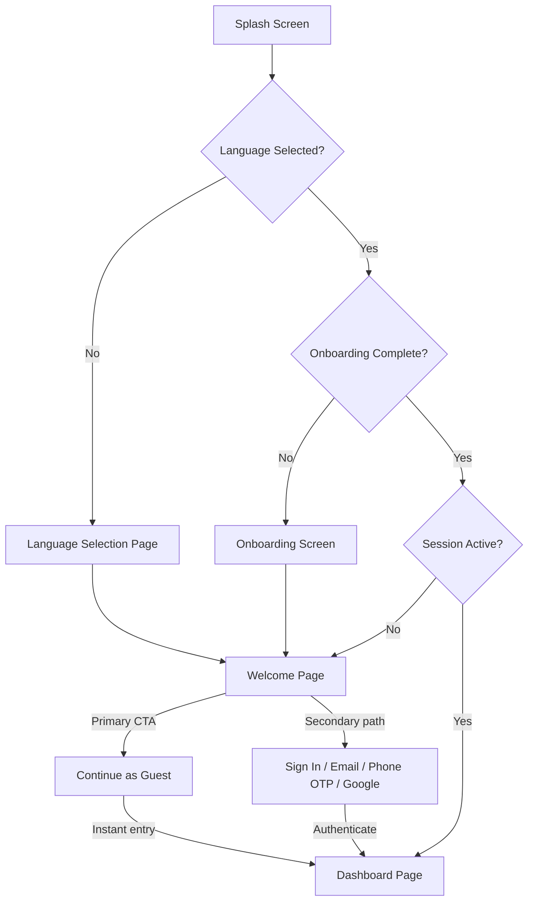
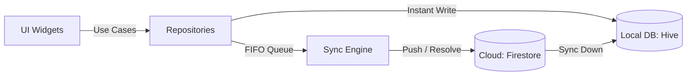
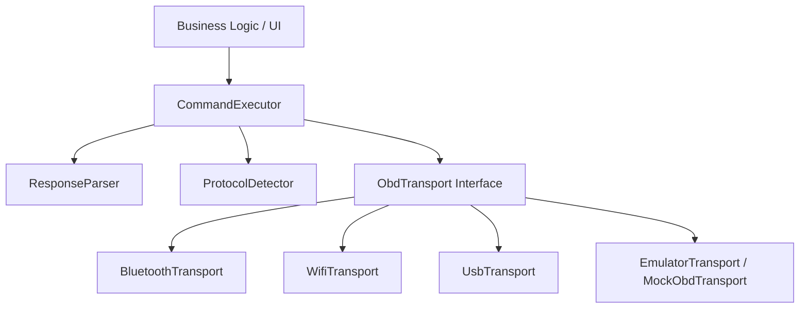
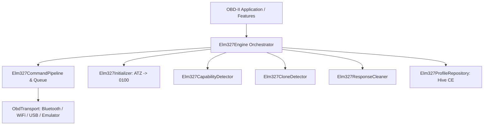
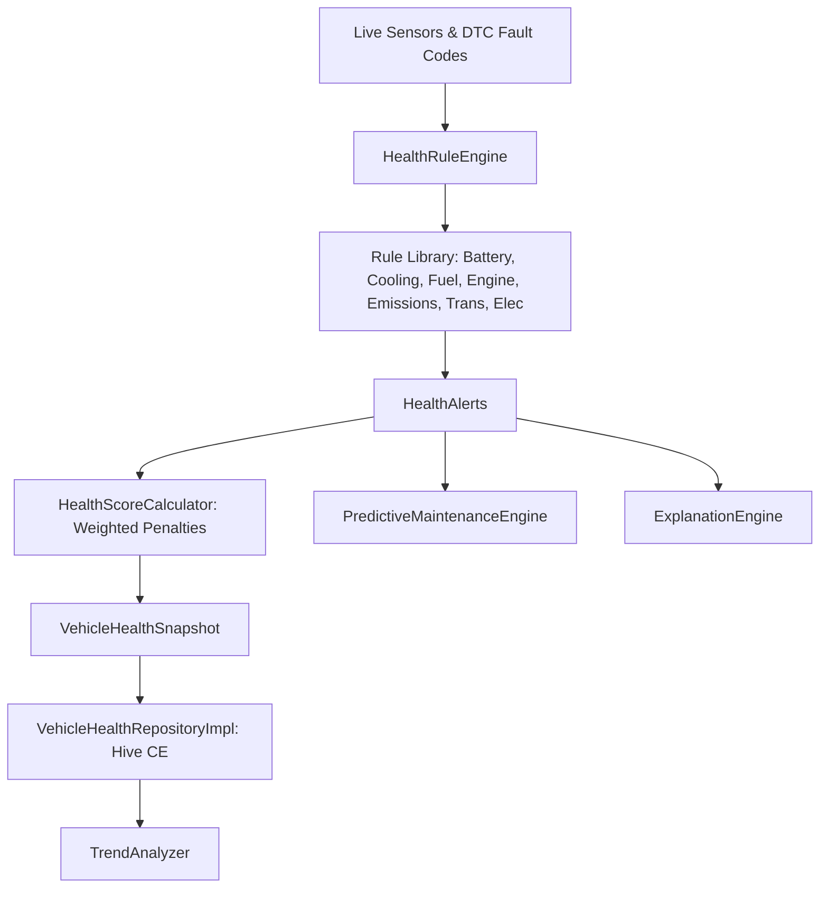
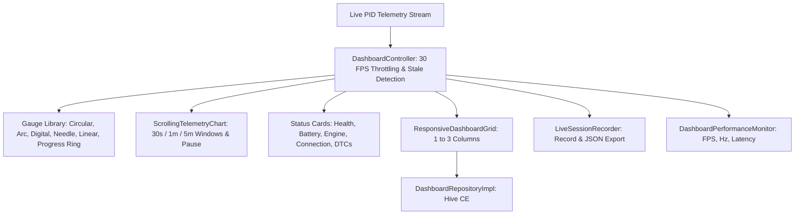
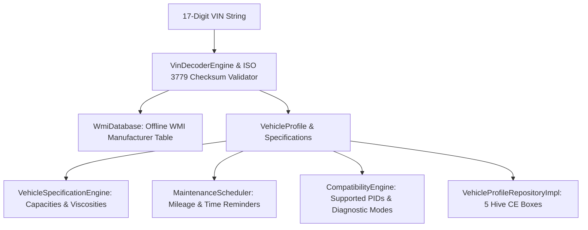
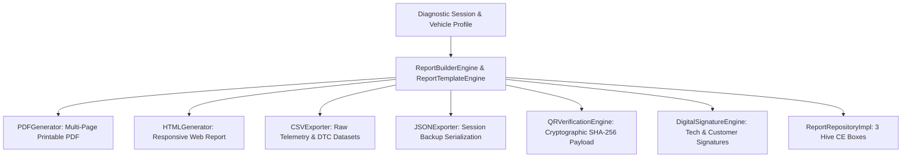

# BizSCAN Foundation

BizSCAN is a professional, production-grade, AI-powered Vehicle Health Diagnostics mobile application designed to connect to ELM327 OBD-II scanners.

This repository hosts the **Clean Architecture foundation** of the application. It contains the core styling theme, custom Material 3 UI widgets, GoRouter navigations with authentication guards, Riverpod state providers, central logging, functional error handlers, and mock service implementations.

---

## 🏗️ Architecture

The codebase follows the principles of **Clean Architecture** combined with **Feature-First / Feature-Sliced Pattern**. This ensures high decoupling, strict separation of concerns, testability, and future scalability.

### Core Concepts:
1. **Unidirectional Data Flow**: Presentation (UI) ➡️ Providers (Riverpod) ➡️ Domain (Use Cases/Contracts) ➡️ Data (Repositories/APIs).
2. **SOLID Principles**: Highly adhered to. Every class has a single responsibility.
3. **No Direct Dependencies**: The UI layer communicates only via interface contracts (`domain` layer). Implementations (`data` layer) are registered dynamically using **GetIt** dependency injection.

---

## 📂 Folder Structure

```
lib/
├── core/
│   ├── config/          # Global configuration (environments, variables)
│   ├── constants/       # Asset paths, design dimensions, static string keys
│   ├── errors/          # Custom Exceptions, Failures, and the functional Result<T> monad
│   ├── extensions/      # BuildContext extensions (Responsive layout helpers, styling shortcuts)
│   ├── router/          # GoRouter setup, Route paths, page transition overrides, Auth guards
│   ├── services/        # Centralized services (GetIt DI, Custom Logging service)
│   ├── theme/           # Material 3 Color Schemes, Typography (Inter/Noto), Radiuses, Shadows
│   └── utils/           # Input Validators, DateTime Formatters, NetworkInfo, PermissionHelper
│
├── shared/
│   ├── animations/      # Global animations transitions
│   ├── dialogs/         # Reusable material dialog overlays and snackbar alert utilities
│   └── widgets/         # Custom premium buttons, text fields, cards, loading/empty/error screens
│
├── features/            # Feature-Sliced modules containing Presentation, Domain, Data layers
│   ├── authentication/  # Splash screen, Onboarding navigation placeholder, and Login Form
│   ├── dashboard/       # Tab scaffold container, animated M3 Navigation Bar, and Home Dashboard
│   ├── vehicle/         # Vehicle Info list and live sensor readout grids
│   ├── reports/         # Diagnostic trouble checkpoints checklist
│   ├── history/         # Diagnostic scan history logs
│   ├── settings/        # App preference items and language configurations
│   ├── bluetooth/       # Bluetooth search and connection management contracts
│   ├── obd/             # OBD-II scanner data fetch contracts
│   └── health/          # AI vehicle health analysis contracts
│
└── main.dart            # Flutter Entrypoint. Initializes DI, handles global exceptions, sets Providers
```

---

## 🏷️ Naming Conventions

* **Files & Folders**: `snake_case` (e.g. `logging_service.dart`, `app_button.dart`).
* **Classes & Enums**: `PascalCase` (e.g. `LoggingServiceImpl`, `AppBluetoothState`).
* **Variables & Methods**: `camelCase` (e.g. `connectDevice`, `showOnboarding`).
* **Riverpod Providers**: Suffix with `Notifier` or `Provider` (e.g. `OBDStateNotifier`).
* **Contracts & Implementations**: Append `Impl` to the data layer class implementing a domain contract (e.g. `BluetoothRepositoryImpl` implements `BluetoothRepository`).

---

## 🚀 How to Run

### Prerequisites
- Stable Flutter SDK (v3.29.0 or higher)
- Dart SDK (v3.7.0 or higher)

### Setup & Run
1. Clone or copy this directory to your workstation.
2. Run package resolution:
   ```bash
   flutter pub get
   ```
3. Run the Riverpod code generator:
   ```bash
   flutter pub run build_runner build --delete-conflicting-outputs
   ```
4. Run the application:
   ```bash
   flutter run
   ```

---

## 🛠️ How to Build

### Verify Code Quality (Lints & Tests)
Before shipping, ensure the code analysis is 100% green and unit tests pass:
```bash
flutter analyze
flutter test
```

### Build Production Artifacts
- **Android APK**:
  ```bash
  flutter build apk --release
  ```
- **Android App Bundle (AAB)**:
  ```bash
  flutter build appbundle --release
  ```
- **iOS IPA**:
  ```bash
  flutter build ipa --release
  ```

---

## ➕ How to Add a New Feature

To add a new feature (e.g. `engine_tuning`), follow these steps:

1. **Create the Folder Structure**:
   Create a new directory under `lib/features/engine_tuning` with three folders:
   - `domain/` (Entities, Use Cases, Repository contracts)
   - `data/` (Models, Data Sources, Repository implementations)
   - `presentation/` (Pages, Widgets, Riverpod providers)

2. **Define the Domain Contract**:
   Create `lib/features/engine_tuning/domain/repositories/tuning_repository.dart`:
   ```dart
   abstract class TuningRepository {
     Future<Result<bool>> applyTune(String profileId);
   }
   ```

3. **Implement the Repository**:
   Create `lib/features/engine_tuning/data/repositories/tuning_repository_impl.dart`:
   ```dart
   class TuningRepositoryImpl implements TuningRepository {
     @override
     Future<Result<bool>> applyTune(String profileId) async {
       // Data source implementation logic
       return const Result.success(true);
     }
   }
   ```

4. **Register with GetIt**:
   Open `lib/core/services/di_service.dart` and register your new repository implementation:
   ```dart
   sl.registerLazySingleton<TuningRepository>(() => TuningRepositoryImpl());
   ```

5. **Expose the Provider**:
   Create `lib/features/engine_tuning/presentation/providers/tuning_provider.dart`:
   ```dart
   import 'package:riverpod_annotation/riverpod_annotation.dart';
   part 'tuning_provider.g.dart';
   
   @riverpod
   class TuningNotifier extends _$TuningNotifier {
     @override
     FutureOr<void> build() {}
     
     Future<void> tune(String profileId) async { ... }
   }
   ```
   Run `flutter pub run build_runner build` to generate the `.g.dart` file.

 6. **Create the UI and Register Route**:
   Create your presentation pages in `lib/features/engine_tuning/presentation/pages/tuning_page.dart` and register the route paths in `lib/core/router/app_router.dart`.

---

## 🔥 Firebase Setup

To transition from the local offline fallback repository to a live Firebase instance, configure your mobile profiles:

### 1. Android Configuration
1. Go to the Firebase Console and create a new project.
2. Register an Android app using your package name: `com.example.bizscan`.
3. Download `google-services.json` and place it in the `android/app/` directory.
4. The necessary buildscript dependencies are already added to `android/build.gradle` and `android/app/build.gradle`.

### 2. iOS Configuration
1. Register an iOS app in your Firebase project.
2. Download `GoogleService-Info.plist`.
3. Open iOS runner project in Xcode and drag `GoogleService-Info.plist` into the `Runner/` directory.

### 3. Firestore Configuration
1. Create a Firestore database.
2. Create a collection named `users`. The document ID should correspond to the user's `userId` (UID).
3. The application will automatically create and update the user profile matching the Freezed schema:
   ```json
   {
     "userId": "string",
     "displayName": "string",
     "email": "string",
     "phone": "string?",
     "photoUrl": "string?",
     "language": "string",
     "themeMode": "string",
     "preferredUnit": "string",
     "isGuest": false,
     "createdAt": "timestamp",
     "updatedAt": "timestamp"
   }
   ```

---

## 🔐 Authentication & Session Flow

The login structure utilizes a strict redirection guard tree inside GoRouter, prioritizing a low-friction "Guest-first" experience:



---

## 👤 Guest Mode & User Migration

### Guest Session Properties:
- Guest users receive a temporary session identifier (`guest_user_id` as a UUID) and a local mock profile stored inside `SharedPreferences`.
- Guests can access all local diagnostic features but cloud sync features remain inactive.

### Transparent Migration:
When a Guest decides to register a permanent account (`signUpWithEmail`):
1. **Settings Preservation**: The local language selections and theme preferences are copied from the guest's local cache.
2. **Cloud Propagation**: During permanent registration, the settings are written directly into the newly created cloud user profile document.
3. **Session Cleared**: Guest identifiers and session profiles are purged from local storage, making the login session fully active.

---

## 🗄️ Offline-First Data Platform

BizSCAN is built on a strict **Offline-First architectural design**. Every read/write database transaction initiated by business logic must route through an abstract Repository contract. UI components never interact with local database drivers or cloud Firestore SDKs directly.



### 1. Local Database (Hive Boxes)
Local caching runs on **Hive CE**, storing data as JSON strings to avoid TypeAdapter versioning conflicts:
- `vehicles`: Cache of all registered vehicles.
- `scans`: Diagnostic session logs history.
- `health_reports`: Completed diagnostic report scores and recommendations.
- `live_pids`: Live sensor PID readouts keyed by `scanId_pid`.
- `pdf_reports`: Metadata of generated reports.
- `settings`: Local user configuration settings (language, units, theme).
- `sync_queue`: Pending actions (create, update, delete) queued for background sync.
- `sync_logs`: FIFO transaction auditor records.
- `conflict_logs`: Logs detailing conflict resolution actions.

### 2. Firestore Collection Schemas

#### `vehicles` Collection
```json
{
  "vehicleId": "string",
  "ownerId": "string",
  "nickname": "string",
  "manufacturer": "string",
  "model": "string",
  "year": "number",
  "fuelType": "string",
  "engineCapacity": "number",
  "vin": "string",
  "registrationNumber": "string",
  "createdAt": "timestamp",
  "updatedAt": "timestamp"
}
```

#### `scan_sessions` Collection
```json
{
  "scanId": "string",
  "vehicleId": "string",
  "userId": "string",
  "startedAt": "timestamp",
  "completedAt": "timestamp?",
  "connectionType": "string",
  "bluetoothDevice": "string?",
  "protocol": "string",
  "scanDuration": "number",
  "firmwareVersion": "string?",
  "appVersion": "string",
  "isSynced": "boolean"
}
```

#### `health_reports` Collection
```json
{
  "reportId": "string",
  "scanId": "string",
  "overallScore": "number",
  "engineScore": "number",
  "batteryScore": "number",
  "coolingScore": "number",
  "fuelScore": "number",
  "emissionScore": "number",
  "recommendations": "array<string>",
  "createdAt": "timestamp",
  "updatedAt": "timestamp"
}
```

### 3. Sync & Conflict Resolution Strategy
- **Auto Background Sync**: The Sync Engine processes items in the `sync_queue` Box sequentially (FIFO). If a write succeeds, the item is cleared and an audit log is saved in `sync_logs`.
- **Conflict Strategy (Last Write Wins)**: If a document being updated locally is found to be newer in the cloud (based on the `updatedAt` timestamp), the Sync Engine detects a conflict, writes the conflict description to `conflict_logs` (and the `sync_logs` Firestore collection), and pulls down the cloud version to overwrite the local cache.
- **Offline Resilience**: If a network failure occurs, the Sync Engine catches the error, halts queue processing, and leaves the items in the queue to be retried on the next trigger.

### 4. Firestore Composite Indexes
To support advanced queries (e.g. searching scan history or vehicles by owner, status, and sorted dates), define these composite indexes in the Firebase Console:
1. **Collection**: `scan_sessions`
   - Fields: `userId` (Ascending), `startedAt` (Descending)
2. **Collection**: `health_reports`
   - Fields: `scanId` (Ascending), `createdAt` (Descending)
3. **Collection**: `vehicles`
   - Fields: `ownerId` (Ascending), `manufacturer` (Ascending)

### 5. Storage Folder Structure
File assets are stored in Firebase Storage buckets under:
- `reports/`: Diagnostic PDF reports.
- `avatars/`: User profile images.
- `vehicle_images/`: User vehicle photos.

---

## 🔌 Hardware-Independent Communication Abstraction Layer

BizSCAN uses a **Hardware-Independent Communication Architecture**. All OBD communication logic is decoupled from physical transport mechanisms via abstract interfaces. Application logic communicates exclusively through `ObdTransport`, `CommandExecutor`, `ResponseParser`, `ProtocolDetector`, and `ConnectionMonitor`.



### 1. Transport Abstraction Layer
- `ObdTransport`: Base contract (`connect`, `disconnect`, `isConnected`, `send`, `receive`, `stream`, `dispose`).
- Hardware Sub-Interfaces: `BluetoothTransport`, `WifiTransport`, `UsbTransport`, `EmulatorTransport`.
- `MockObdTransport`: In-memory simulator for offline testing, hardware emulation, and mock response generation (`010C`, `010D`, `0105`, `03`, `0902`).

### 2. Command Executor & Queueing
- `CommandExecutor` / `DefaultCommandExecutor`: Manages command queueing, retries, timeout delays, and stream broadcasting (`commandStream`, `responseStream`).
- AT/PID Command Handlers: Automatically formats and validates adapter initialization (`ATZ`, `ATE0`, `ATSP0`).

### 3. Response Parser
- `ResponseParser` / `DefaultResponseParser`: Decodes raw hex strings and converts PID responses to typed data:
  - **Engine RPM (PID 010C)**: `((A * 256) + B) / 4`
  - **Vehicle Speed (PID 010D)**: `A` (km/h)
  - **Coolant Temperature (PID 0105)**: `A - 40` (°C)
  - **DTC Fault Codes (Mode 03/07)**: Bitwise parsing of P, C, B, and U fault codes.
  - **VIN Number (Mode 0902)**: ASCII byte decoding.

### 4. Connection State Machine & Monitoring
- `ObdConnectionState`: Enum modeling connection states: `disconnected`, `connecting`, `initializing`, `ready`, `busy`, `error`, `reconnecting`.
- `ConnectionMonitor`: Reactive state manager broadcasting `stateStream`, `latencyStream`, and `errorStream`.

### 5. Future Hardware Integration Paths
- **Bluetooth ELM327**: Implemented via `BluetoothTransportImpl` using Bluetooth Classic Serial Port Profile (SPP) sockets.
- **Wi-Fi ELM327**: Implement `WifiTransport` using raw TCP sockets (`192.168.0.10:35000`).
- **USB Adapter**: Implement `UsbTransport` using serial port streams (`FTDI/CH340`).
- **Vehicle Hardware Emulator**: Implement `EmulatorTransport` to inject custom PIDs and DTC fault codes for offline testing.

---

## 📶 Bluetooth Classic (SPP) Transport Layer

BizSCAN includes a production-grade **Bluetooth Classic Transport Layer** implementing `BluetoothTransport` (which connects into `ObdTransport`).

### 1. Architectural Components
- `BluetoothTransportImpl`: Concrete adapter implementing `BluetoothTransport`. Plugs directly into `ObdTransport` via Dependency Injection.
- `BluetoothPermissionServiceImpl`: Safely handles Android 10, 11, 12, 13, and 14+ permissions (`BLUETOOTH_SCAN`, `BLUETOOTH_CONNECT`, `ACCESS_FINE_LOCATION`).
- `BluetoothStateMonitorImpl`: Streams hardware Bluetooth state transitions (`enabled`, `disabled`, `turningOn`, `turningOff`).
- `BluetoothDiscoveryServiceImpl`: Performs discovery, deduplicates devices by MAC address, and sorts bonded/paired devices first followed by RSSI signal strength.
- `BluetoothConnectionServiceImpl`: Manages SPP Serial Port Profile socket channels and incoming stream buffers.
- `BluetoothAutoReconnectServiceImpl`: Exponential backoff algorithm (`1s`, `2s`, `4s`, `8s`, `16s`, max 5 retries). Automatically stops when a user manually disconnects.
- `BluetoothDeviceRepositoryImpl`: Stores last connected device metadata, preferred devices, and timeout settings in `SharedPreferences`.

### 2. User Interface Views
- `BluetoothScanPage`: M3 scanner page with animated radar indicator, device search bar, and segment filter buttons.
- `BluetoothDeviceList`: Card list displaying RSSI signal meters, MAC addresses, pairing badges, and Connect buttons.
- `PairDialog` & `ConnectionProgressDialog`: Modals for pair confirmation and SPP connection progress.
- `BluetoothDisabledView` & `PermissionRequiredView`: Clean state views handling disabled hardware and denied permissions gracefully.

---

## ⚙️ ELM327 Engine Layer

BizSCAN features a production-grade **ELM327 Engine** that encapsulates all adapter-specific initialization, response cleaning, protocol detection, clone evaluation, and freeze recovery.



### 1. Engine Components & Architecture
- `Elm327Engine`: Core orchestrator managing connection setup, command pipeline, profile storage, and auto-recovery.
- `Elm327Initializer`: Executes mandatory initialization sequence (`ATZ` ➡️ `ATE0` ➡️ `ATL0` ➡️ `ATS0` ➡️ `ATH0` ➡️ `ATSP0` ➡️ `ATI` ➡️ `ATRV` ➡️ `0100`).
- `Elm327CapabilityDetector`: Detects multi-frame support, CAN bus, KWP2000, ISO9141, J1850, and fast/slow initialization modes.
- `Elm327CloneDetector`: Assesses adapter firmware authenticity, detects fake v1.5/v2.1 versions, and calculates clone confidence scores (0 to 100).
- `Elm327ResponseCleaner`: Strips prompt characters (`>`), carriage returns, linefeeds, spaces, and handles hardware errors (`UNABLE TO CONNECT`, `BUS ERROR`, `CAN ERROR`, `BUFFER FULL`, `STOPPED`).
- `Elm327CommandQueue` & `Elm327CommandPipeline`: Priority queue implementation with duplicate command suppression, timeout retries, and cancellation support.
- `Elm327CommandScheduler`: Periodically schedules dynamic PID telemetry polling.
- `Elm327ProfileRepositoryImpl`: Persists known adapter profiles and latency metrics in local Hive CE box `elm327_profiles`.

### 2. Auto-Recovery Strategy
If an adapter freezes or returns buffer overflow errors (`Elm327FreezeFailure`), the engine automatically:
1. Shifts state to `Elm327State.recovering`.
2. Sends reset command `ATZ` and waits 500ms.
3. Re-executes the initialization sequence (`ATZ` ➡️ `0100`).
4. Re-enqueues the interrupted command and resumes queue processing.

---

## 🧠 Vehicle Health & Intelligence Engine

BizSCAN features an offline **Vehicle Health & Intelligence Engine** that converts raw PID sensor data and DTC fault codes into actionable diagnostic intelligence, weighted scores, trend trajectories, predictive maintenance timelines, and plain English repair explanations.



### 1. Architectural Components
- `HealthRuleEngine`: Evaluates rule sets, suppresses duplicate alerts, and prioritizes active issues.
- `HealthScoreCalculator`: Implements weighted penalty scoring starting from 100:
  - **100**: Perfect vehicle condition
  - **90–99**: Minor issue (e.g. minor sensor drift)
  - **70–89**: Medium issue (e.g. low resting battery voltage 11.5V)
  - **40–69**: Serious issue (e.g. cylinder misfires or high fuel trim vacuum leak)
  - **< 40**: Critical issue (e.g. severe engine coolant overheat >110°C)
- `TrendAnalyzer`: Evaluates historical snapshots to detect battery voltage degradation, coolant temperature escalation, and recurring DTCs.
- `PredictiveMaintenanceEngine`: Estimates remaining useful life and repair recommendations for 12V battery, spark plugs/coils, air filter cleaning, coolant flush, and routine oil service.
- `ExplanationEngine`: Generates user-accessible explanations answering: why the recommendation appeared, root cause sensors/DTCs, confidence, driveability advice (Safe / Exercise Caution / Stop Immediately), repair urgency, and DIY feasibility.
- `VehicleHealthRepositoryImpl`: Persists health snapshots locally in Hive CE box `vehicle_health_history`.

---

## 📊 Live Telemetry & Interactive Dashboard Platform

BizSCAN features a real-time **Interactive Dashboard Platform** capable of high-frequency sensor rendering, smooth gauge animations, custom layouts, scrolling charts, diagnostic recording, and performance monitoring.



### 1. Architectural Components
- `DashboardController`: Manages live telemetry streams, applies 30 FPS UI frame throttling (33ms window), caches previous values for smooth pointer animations, and flags stale data (>3,000ms old).
- `Gauge Widget Library`: Comprehensive suite of Material Design 3 gauges (`CircularGauge`, `DigitalGauge`, `LinearGauge`, `BatteryGauge`, `RPMGauge`, `SpeedGauge`, `CoolantGauge`, `FuelGauge`) with warning and critical color thresholds.
- `ScrollingTelemetryChart`: Real-time line chart featuring scrolling buffer, 30s/60s/300s windowing, and pause/resume capability.
- `ResponsiveDashboardGrid`: Adaptive grid layout dynamically adjusting to single-column phone screens and multi-column tablet displays.
- `LiveSessionRecorder`: Captures live telemetry frames and exports sessions as structured JSON for diagnostic review.
- `DashboardPerformanceMonitor`: Measures PID update frequency (Hz), widget rebuild count, FPS, and stream latency.
- `DashboardRepositoryImpl`: Persists custom user layouts and widget preferences in local Hive CE box `dashboard_preferences`.

---

## 🚗 Vehicle Intelligence Platform & Maintenance Engine

BizSCAN features an offline **Vehicle Intelligence Platform** providing 17-digit ISO 3779 VIN decoding, WMI database lookups, manufacturer specification lookups, automated maintenance scheduling, PID compatibility detection, and local multi-box persistence.



### 1. Architectural Components
- `VinDecoderEngine` & `VinChecksumValidator`: Decodes 17-character VIN strings, validates ISO 3779 check digits, resolves model year codes, and extracts manufacturer metadata.
- `WmiDatabase`: Offline lookup table mapping 3-character WMI codes to Country, Manufacturer, and Brand.
- `VehicleSpecificationEngine`: Resolves engine oil capacities (viscosity grades), coolant volume, brake fluid specs, battery capacities, and tyre pressures (front/rear).
- `MaintenanceScheduler`: Computes upcoming and overdue maintenance reminders for engine oil, air filter, spark plugs, brake fluid, coolant flush, and transmission fluid based on mileage and time intervals.
- `CompatibilityEngine`: Evaluates supported OBD-II diagnostic modes (Mode 01 - 09), available PIDs, and ECU capabilities.
- `VehicleProfileRepositoryImpl`: Persists data across 5 dedicated Hive CE boxes (`vehicle_profiles`, `vehicle_specifications`, `maintenance_records`, `service_reminders`, `compatibility_profiles`) with active vehicle profile switching.
- `Presentation UI Pages`: Includes `VehicleProfilePage`, `VehicleSpecificationPage`, `MaintenanceSchedulePage`, `ServiceReminderPage`, and `CompatibilityPage`.

---

## 📄 Diagnostic Report Generation & Export Platform

BizSCAN features a professional **Diagnostic Report Platform** supporting custom layout templates, multi-format exports (PDF, HTML, CSV, JSON), SVG chart rendering, cryptographic QR verification, digital signatures, and local multi-box persistence.



### 1. Architectural Components
- `ReportBuilderEngine` & `ReportTemplateEngine`: Assembles comprehensive diagnostic reports with configurable section ordering across pre-built Workshop, Fleet, Customer, Dealer, and Minimal templates.
- `PDFGenerator` & `HTMLGenerator`: Produces formatted multi-page PDF documents and responsive HTML reports.
- `CSVExporter` & `JSONExporter`: Exports raw sensor telemetry, DTC histories, and full diagnostic session backups.
- `ChartRenderingEngine`: Renders SVG vector charts for RPM, Speed, Battery Voltage, Coolant Temperature, and Fuel Trims.
- `QRVerificationEngine`: Builds cryptographic SHA-256 QR code verification payloads containing Report ID, VIN, Timestamp, and Hash.
- `DigitalSignatureEngine`: Embeds technician and customer signatures while calculating document hashes to detect modification or tampering.
- `ReportRepositoryImpl`: Persists data across 3 dedicated Hive CE boxes (`reports`, `report_templates`, `report_exports`).
- `Presentation UI Pages`: Includes `ReportDashboardPage`, `ReportPreviewPage`, `TemplateEditorPage`, `SignaturePage`, and `ExportScreenPage`.
